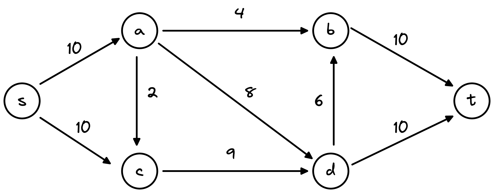

# 6.1 问题、Ford-Fulkerson算法

### 最大流问题

#### 1. 直观理解：

给定如下的有向图(directed graph)：

* 每条边上的数值对应于该边的容量(capacity)，即允许通过该边的最大值。
* 节点s与节点t表示流(flow)的起始与终止位置。
* 对于这样的图，我们称之为网络流图(flow network)。

<figure><figcaption>
directed graph
</figcaption></figure>

在flow network中，我们可以有如下的flow，其中<mark style="color:red;">4/10</mark>(左上角的边)表示边的capacity为10，通过该边的flow的值为4。

<figure><figcaption>
example 1 
</figcaption></figure>

除了上面的，我们还可以有其他的flow：

<figure><figcaption></figcaption></figure>

所以问题在于，给定一个上述的flow network，如何找到该network允许通过的flow的最大值？

> Given a flow network, find a flow of maximum possible value

