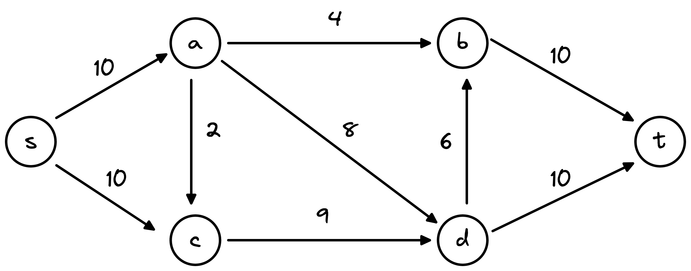
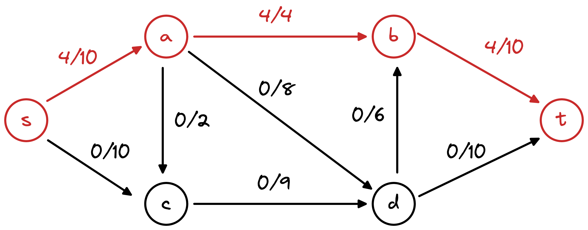

# 6.1 最大流问题 & Ford-Fulkerson算法

## 最大流问题

### 直观理解

给定如下的有向图(directed graph) $$G(V,E)$$：

* 每条边上的数值对应于该边的容量(capacity)，即允许通过该边的最大值。
* 节点s与节点t表示流(flow)的起始与终止位置。
* 对于这样的图，我们称之为网络流图(flow network)。

<figure><figcaption>
flow network
</figcaption></figure>

在flow network中，我们可以有如下的flow，其中<mark style="color:red;">4/10</mark>(左上角的边)表示边的capacity为10，通过该边的flow的值为4。

<figure><figcaption>
example 1 
</figcaption></figure>

除了上面的，我们还可以有其他的flow：

<figure><figcaption>
example 2
</figcaption></figure>

所以问题在于，给定一个上述的flow network，如何找到该network允许通过的flow的最大值？

> Given a flow network, find a flow of maximum possible value

举一个实际中的例子，我们可以将边考虑成水管，节点认为是阀门。最大流问题就成了：如何确定一个互相连通的系统中某一时刻水流量的最大值。每条边的capacity也即是水管的容量。

另一个例子是：在战时，我们想从一个城市(s)到另一个城市(t)运送战略物资，每个节点就是运送过程中需要途经的城市，每条边的capacity就是两个城市之间交通系统每天的运载量。问题是：每天我们最多能够运送多少物资到目的地？

### 形式化定义

上面的描述实际上太过于模糊，我们需要对该问题进行清晰的、形式化的定义。

> 下面会设计到大量的数学定义，但是他们都是可以被理解的。

首先我们定义flow network：

* flow network是指满足以下条件的graph：
  * directed
  * 每条边有对应capacity，并且capacity >=0，capacity非负
  * 有且仅有一个点(s)没有入边，有且仅有一个点(t)没有出边
    * 其他的节点都需要同时有出边与入边

flow network的定义是直观的。接着我们定义**flow**：

* **(s-t) flow**
  * 是定义在flow network上的一个**函数**，将flow network每一条边(**e**)映射为一个**实数**，即：$$f: E \rightarrow R^+$$
    * 即 对于一个flow，我们需要指明每一条边上通过flow是多少，如example 1与2中，每天边/左边的数就是其对应的flow的值，即f(e)
    * s-t flow中的s-t是指明flow的起始节点与终止节点
  * 每个flow需要满足两个条件：
    * **capacity:** 对于每一条边 **** $$e \in E, \; 0 \le f(e) \le c(e)$$, 即对于每一条边上的flow，我们要求其必须介于零与该边所能承载的最大值(capacity)之间。
      * 这同样是直观的，回到水管的例子，水管中的水流量不能超过水管的容量，同时也不能为负（也许可以定义为反着流，但是在我们的例子中水都是沿着水管往一个方向流，不允许出现反向流动）
    * **conservation:** 对于每一个节点(除开s与t), $$v \in V-\{s,t\}$$，其流入的flow等于流出的flow：
